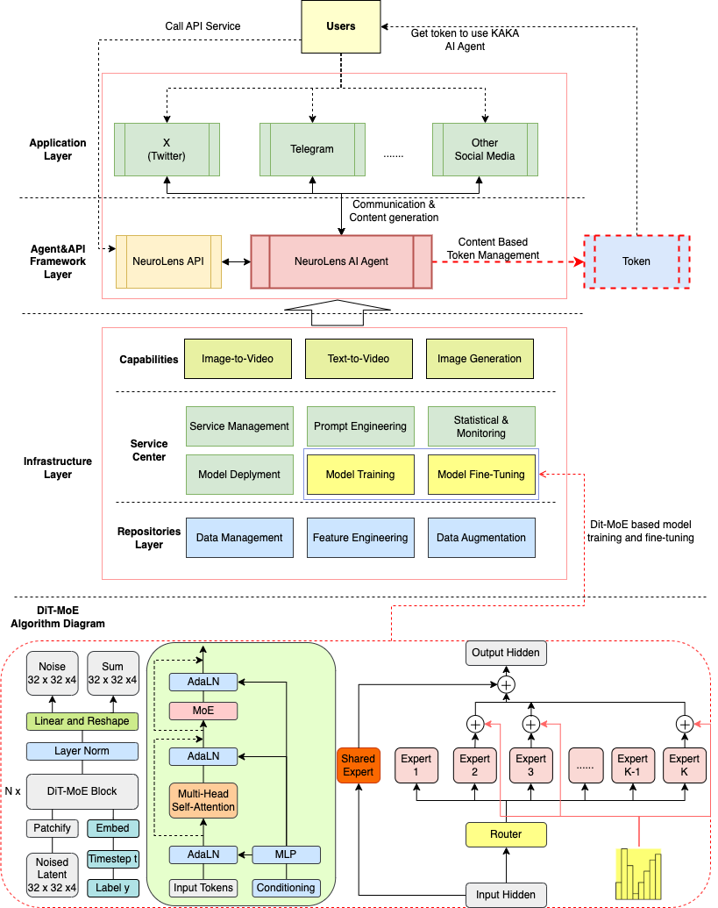

# OpenApi
Open API for NeuroLens framework

## Introduction
**NeuroLens framework** allows users to create stunning AI-generated videos using textual prompts and input images. This service leverages advanced machine learning models to produce highly creative and personalized video content. The API is designed to handle asynchronous requests, enabling efficient processing and delivery of video outputs.

**Key Features:**
- Generate videos by providing descriptive prompts and image references.
- Asynchronous processing to handle complex video generation tasks.
- Secure access via authentication tied to a whitelisted email.
- Easily query the status of submitted requests and retrieve generated videos.

**See :point_right: [API Document](./docs/Readme.md) :point_left:  for more details!**

## [UPDATE] 01/23,2025

**We have opened API trial applications, please fill out the [Waitlist Form](https://forms.gle/nYwaYnJckf2usqFe8) to apply for permission!** :fire::fire::fire::rocket::rocket::rocket:

## System Architecture

